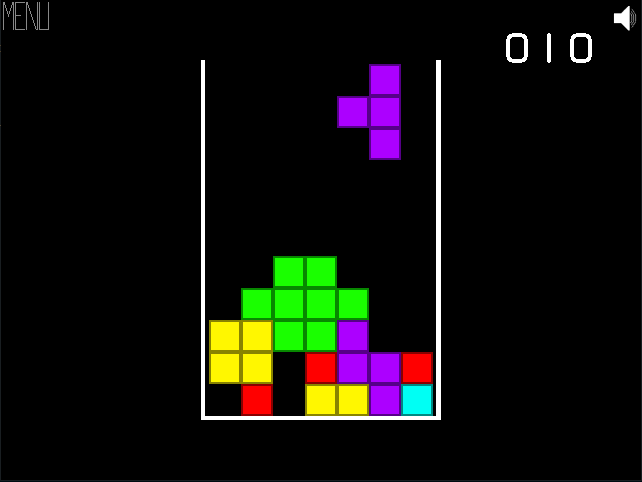

# Mason Simulator '20



A Tetris clone with a custom game engine built from scratch with C++ and SDL.

Windows is the only supported operating system at this time.

## Requirements

You need the following things in order to build / run this application...

- SDL2
- MinGW (g++)

You can see the makefile for where the make commands expect includes to be.

## Usage

If you get everything set up properly, you should just be able to run the following command...

```
make run
```

## Controls

A - Move block left

D - Move block right

Q - Rotate block left

E - Rotate block right

S - Snap block into place
